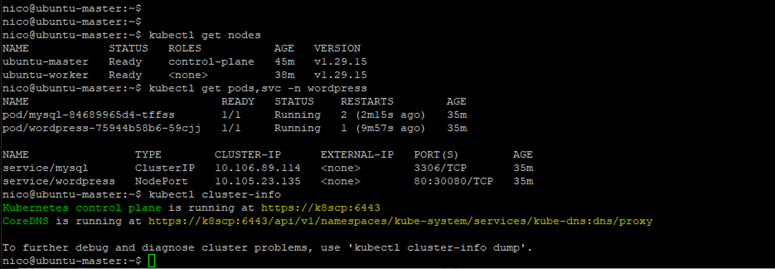
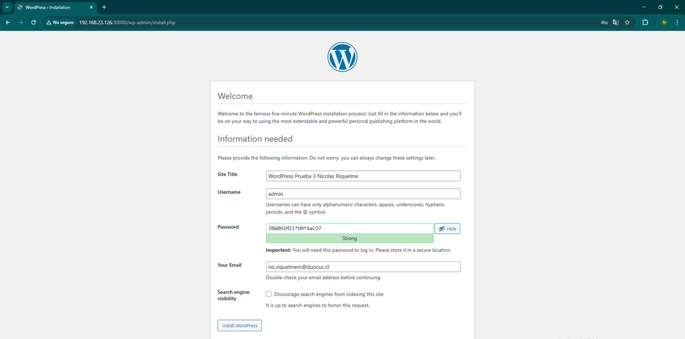
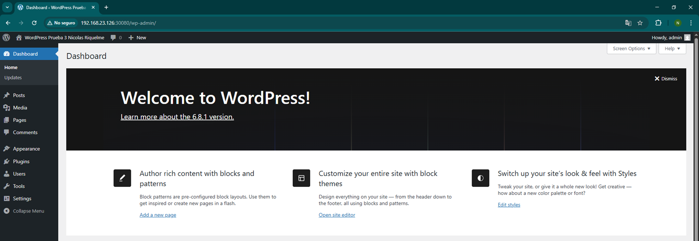

# DIY7111-003V-PRUEBA3-NRIQUELME-Wordpress-MYSQL
Evidencia y registro de lo solicitado en EA3 de la asignatura, contiene todos los manifiestos YAML utilizados para desplegar WordPress y MySQL en clúster de Kubernetes.


## 📁 Estructura del Repositorio

```
.
├── evidencias/
│   ├── evidencia1.png
│   ├── evidencia2.png
│   └── evidencia3.png
├── manifests
│   ├── mysql-deployment.yaml
│   ├── mysql-pv.yaml
│   ├── mysql-pvc.yaml
│   ├── wordpress-deployment.yaml
│   ├── wordpress-pv.yaml
│   ├── wordpress-pvc.yaml
│   ├── wordpress-service.yaml
├── README.md
```

---

##  Componentes del Despliegue

- **MySQL 5.7**
  - Configurado con volumen persistente (PV/PVC)
  - Variables de entorno: usuario, contraseña, base de datos
- **WordPress**
  - Imagen oficial `wordpress:latest`
  - Conectado a MySQL mediante variable de entorno
  - Expuesto mediante un `NodePort`

---

##  Evidencias del Despliegue

###  1. Nodos en estado Ready

Se verifica que ambos nodos (`master` y `worker`) se encuentran en estado `Ready` mediante el siguiente comando:

```bash
kubectl get nodes
```

###  2. Pods y servicios corriendo

Se despliegan los recursos de WordPress y MySQL dentro del namespace `wordpress`. Ambos pods están en estado `Running`, y los servicios están correctamente expuestos:

```bash
kubectl get pods,svc -n wordpress
```

####  Clúster Kubernetes

Se utiliza comando `kubectl cluster-info` para mostrar los endpoints principales del clúster, como el servidor API de Kubernetes y el DNS interno. Este comando es útil para validar que el clúster se encuentra funcionando y sea accesible.





---

###  3. Acceso a WordPress vía navegador

Se accede exitosamente a la página de instalación de WordPress a través del puerto 30080:

```
http://192.168.23.126:30080/wp-admin/install.php
```




---

##  Despliegue paso a paso

```bash
kubectl create namespace wordpress

kubectl apply -f manifests/mysql-pv.yaml
kubectl apply -f manifests/mysql-pvc.yaml
kubectl apply -f manifests/mysql-deployment.yaml

kubectl apply -f manifests/wordpress-pv.yaml
kubectl apply -f manifests/wordpress-pvc.yaml
kubectl apply -f manifests/wordpress-deployment.yaml
kubectl apply -f manifests/wordpress-service.yaml
```

---

##  Acceso a WordPress

Una vez desplegado, WordPress estará disponible desde:

```
http://192.168.23.126:30080
```



---
